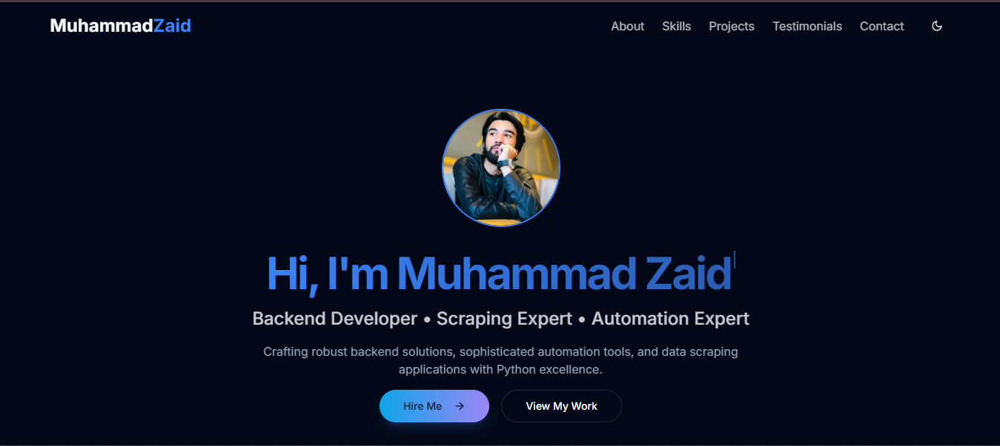

# Muhammad Zaid – Portfolio

Welcome to my portfolio!  
I'm **Muhammad Zaid**, a passionate Software Engineer specializing in backend development, automation, and web scraping with Python.

---



---
## 👨‍💻 About Me

With 2+ years of hands-on experience, I craft robust backend solutions, sophisticated automation tools, and data scraping applications. My expertise includes:

- **Backend Development** (Python, Django, Flask, FastAPI)
- **Automation & Web Scraping** (Selenium, BeautifulSoup, Requests)
- **Frontend & Full-Stack** (React, Node.js, PHP, MySQL, SQL, HTML5, CSS3)
- **Other Tools**: PyQt5, Redis, PostgreSQL, MongoDB, AWS S3, Bootstrap

I thrive on solving complex challenges through clean, scalable code and have delivered impactful solutions across diverse domains.

---

## 🚀 Featured Projects

- **E-commerce Data Scraper**  
  Robust system extracting product data, prices, and reviews from multiple e-commerce platforms.  
  _Python, Selenium, BeautifulSoup, MongoDB_

- **Automated Workflow System**  
  Customizable tool for marketing teams to schedule and manage social media posts.  
  _Python, Django, React, Redis, PostgreSQL_

- **REST API for Inventory Management**  
  Secure, scalable API with authentication, rate limiting, and documentation.  
  _Python, Flask, JWT, MySQL, Swagger_

- **Real-time Analytics Dashboard**  
  Interactive dashboard for business metrics and KPIs with real-time updates.  
  _React, Node.js, D3.js, WebSockets, MongoDB_

- **Content Management System**  
  Customizable CMS with role-based access, media management, and API integration.  
  _Python, Django, PostgreSQL, AWS S3, React_

- **Learning Management System**  
  LMS with role-based access, media management, and clean API.  
  _Python, Django, SQLite, HTML5, CSS3, Bootstrap_

---

## 🛠️ What I Bring to the Table

- Clean, well-documented, and maintainable code
- Real-world automation & scraping tools
- Scalable APIs and backend systems
- Full-stack web applications
- Security-aware development approach

---

## 📫 Contact

- **Email:** zaidkx37@gmail.com
- **Phone:** +92 332 9975 307
- **GitHub:** [zaidkx7](https://github.com/zaidkx7)
- **LinkedIn:** [zaidkx37](https://linkedin.com/in/zaidkx37)
- **WhatsApp:** [Chat on WhatsApp](https://wa.me/923329975307)
- **Upwork:** [View Profile](https://www.upwork.com/freelancers/~01aaf487e29d60a885)

---

## 🛠️ Technologies Used in This Portfolio

- Vite
- TypeScript
- React
- shadcn-ui
- Tailwind CSS

---

## 🚀 Getting Started

```sh
git clone <YOUR_GIT_URL>
cd <YOUR_PROJECT_NAME>
npm install
npm run dev
```

---

Thank you for visiting my portfolio! If you have a project in mind or want to collaborate, feel free to reach out.
